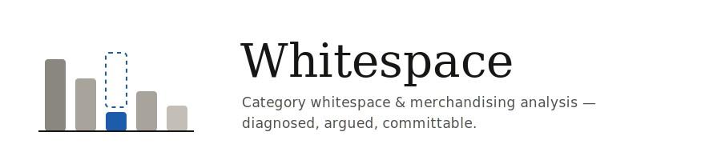
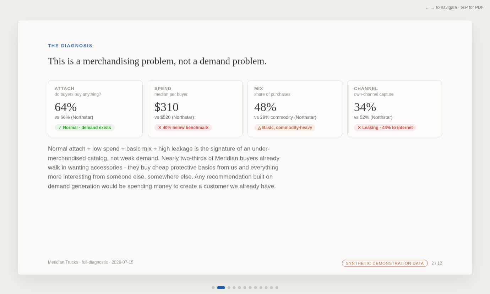
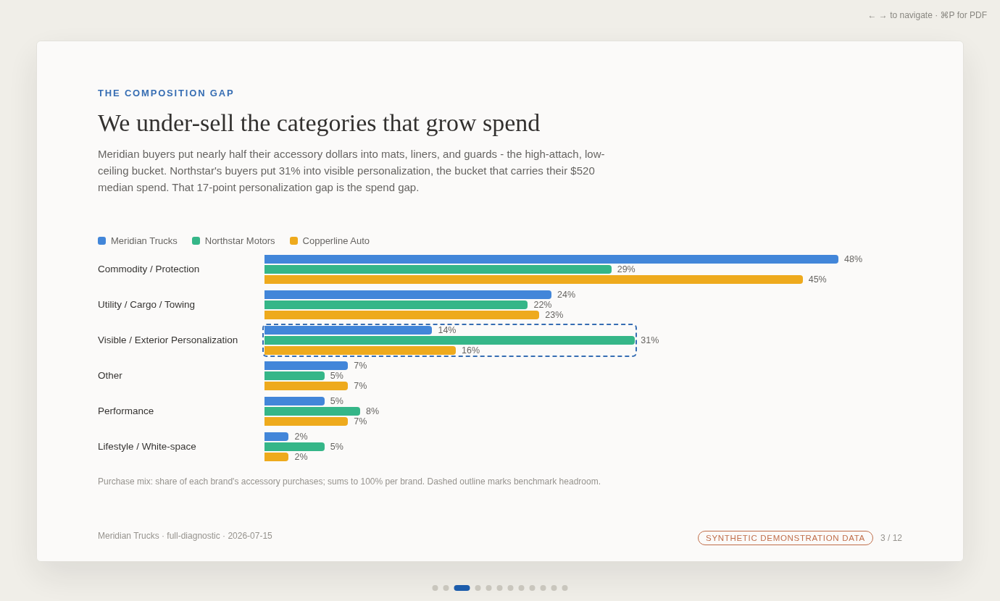
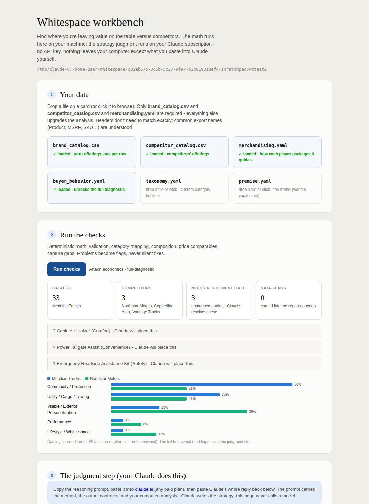
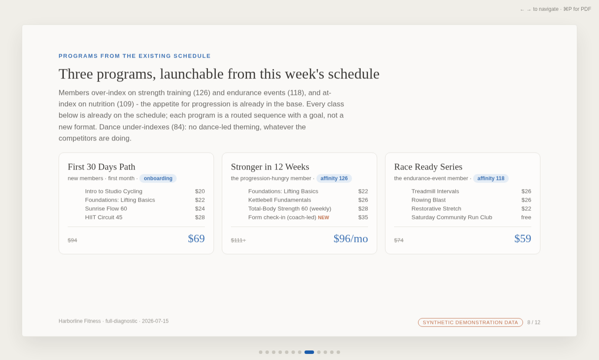
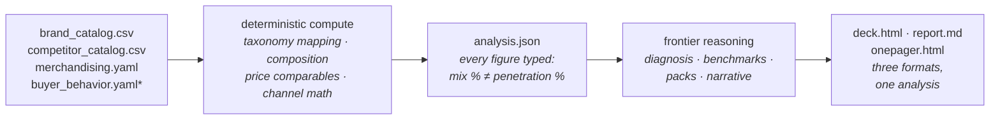

<p align="center">
  <picture>
    <source media="(prefers-color-scheme: dark)" srcset="assets/banner-dark.svg">
    
  </picture>
</p>

<p align="center">
  <a href="https://github.com/hratterman/Whitespace/actions/workflows/ci.yml"></a>
  
  
  <a href="LICENSE"></a>
</p>

Point it at any brand's accessory or add-on catalog, plus a competitor
storefront audit, and get back what a good category strategist would hand
you: **where the brand is leaving money on the table, why, and what
specifically to do about it** - a diagnosed, argued, committable
recommendation, not a dashboard of percentages.

> *"Meridian's buyers attach accessories at the same rate as the best
> benchmark but spend $210 less per buyer doing it - and 44% of what they
> buy, they buy on the internet instead of from us."*
> - from the [demo report](examples/meridian/sample-report.md)

## What you get

Every run produces three deliverables from one analysis: a **slide deck**
(self-contained HTML - keyboard navigation, live charts, print-to-PDF), the
**strategist memo** (Markdown), and an **executive one-pager**.

<p align="center">
  
  
</p>

The decks are rendered deterministically from the model's structured
judgment (`report.json`) plus the computed analysis - the model never
hand-writes presentation HTML, so every deck is polished, consistent, and
chart-accurate. Sample decks: [Meridian](examples/meridian/sample-deck.html)
· [Solstice](examples/solstice/sample-deck.html) (download and open, or
print to PDF).

## You talk to it

The primary interface is a conversation, not a command line. Install once in
Claude Code (terminal, desktop app, claude.ai/code, or Cowork - the plugin
works in all of them):

```
/plugin marketplace add hratterman/Whitespace
/plugin install whitespace@whitespace
```

Then just say what you want, in any project:

> *"Analyze my accessory lineup against Thule and Yakima - here's our
> catalog export."*
> *"Where is my studio leaving money on the table vs the gym across town?"*
> *"/whitespace:analyze demo"*

The skill carries you through everything: it frames your world (or derives a
custom premise for it), scaffolds the data directory, converts whatever data
you have - an export, a pasted list, or nothing yet - into the contract,
asks only the questions it can't answer itself, then computes, writes, and
renders all three deliverables. Every CLI command below is something Claude
runs *for* you.

## No Claude Code? Use the workbench

For everyone else - a colleague with just a claude.ai account, a client -
there's a local browser workbench:

```bash
python3 -m whitespace serve data/mybrand
```

<p align="center">
  
</p>

Drop your files on the cards (templates one click away), run the checks and
read the flags as friendly cards instead of terminal text, copy the
reasoning prompt with one button, paste Claude's reply back, and the deck
renders right on the page. Runs entirely on localhost - stdlib only, no
account, no API key; the judgment work still happens on your own Claude
subscription.

## What to point it at: the premise system

The method runs wherever three things exist: **a portfolio of offerings,
competitors with portfolios of their own, and (optionally) data on what
customers actually choose**. The frame for a given world is a *premise* - a
small, inspectable YAML file that names the four diagnostic questions
(participation / depth / mix / capture) in that world's vocabulary. The
method never changes; the frame does.

| Premise | World | Example |
|---|---|---|
| `attach` (default) | core product + add-ons | vehicle accessories, espresso gear, camera lenses, power-tool systems |
| `replenishment` | install base + consumables | printers/ink, razors/blades, filtration, parts |
| `service` | purchase + coverage/care | warranties, protection plans, install & setup |
| `portfolio` | generic portfolio-vs-competitors | content libraries, practice areas, feature sets |
| **derived** | anything else with the three ingredients | the [Harborline fixture](examples/harborline): a fitness studio's class schedule, framed as participation / frequency / booking mix / aggregator capture |

In Claude Code you never pick one by hand: describe your situation and the
skill matches a preset or **derives a custom premise for your world**, shows
you the frame, and records it in the data directory like any other judgment.
And when a problem genuinely lacks the ingredients - no competitors, no mix
dimension, a single metric over time - the skill says it's the wrong tool
instead of forcing the frame.

<p align="center">
  
</p>

Ingestion is deliberately forgiving: real-world exports work as-is - header
aliases (`Product`, `MSRP`, `SKU`, `Category`…), semicolon/tab delimiters,
BOMs, missing price or category columns all degrade gracefully with flags
instead of errors, and in Claude Code the skill converts pasted lists or
spreadsheets for you.

## How it works

The work is split along the judgment line - deterministic math in code, all
strategy judgment on the frontier model (your Claude subscription; the tool
never calls a model API):



<sup>*optional - its presence flips the run from public-data mode to the full
attach/spend/mix/channel diagnostic; its absence never breaks the base
analysis.</sup>

The method the model follows is spelled out and binding:
[`method/REASONING.md`](method/REASONING.md) (diagnose the *type* of problem
before its size; composition over concentration; benchmark behavior, not
shelf presence; merchandise-first sequencing) and
[`method/OUTPUT_SPEC.md`](method/OUTPUT_SPEC.md) (the deliverable contract).

## Two worked examples

| Fixture | Domain | Mode | Shows |
|---|---|---|---|
| [`examples/meridian`](examples/meridian) | pickup trucks | full-diagnostic | the complete method: demand-vs-merchandising diagnosis, channel recapture, affinity-grounded packs → [sample report](examples/meridian/sample-report.md) |
| [`examples/solstice`](examples/solstice) | espresso gear | public-data | domain portability via a local `taxonomy.yaml` override, and the honest no-behavioral-data voice → [sample report](examples/solstice/sample-report.md) |
| [`examples/harborline`](examples/harborline) | fitness studios | full-diagnostic, **derived premise** | the whole frame re-derived - custom questions, buckets, and channels - with the method intact → [sample report](examples/harborline/sample-report.md) |

Both fixtures are fully synthetic, built to exercise every branch of the
method - including traps the model must catch (false price comparables, a
competitor whose shelf presence never shifted buyer behavior, deliberately
unmappable SKUs).

## Data contract

One directory per analysis (`python3 -m whitespace init <dir>` scaffolds it):

| File | Required | Contents |
|---|---|---|
| `brand_catalog.csv` | yes | `sku_id,name,raw_category,price,applicability` |
| `competitor_catalog.csv` | yes | same, plus a `competitor` column |
| `merchandising.yaml` | yes | storefront-behavior audit: bundles, named packs, curation, bespoke - with a `source` per entry |
| `buyer_behavior.yaml` | no | attach rate, median spend, channel capture, purchase mix, affinity indices - unlocks full-diagnostic mode |
| `taxonomy.yaml` | no | domain override for the category-to-bucket mapping |
| `premise.yaml` | no | the frame: a preset reference (`preset: replenishment`) or a fully custom premise |

Data is *supplied*, never scraped: competitor assortment comes from you, or
from a model-assisted storefront audit session that hands structured rows to
the tool.

## Without the plugin

```bash
git clone https://github.com/hratterman/Whitespace && cd Whitespace
pip install -r requirements.txt                    # pyyaml only
python3 -m whitespace analyze examples/meridian    # deterministic layer
python3 -m unittest discover -s tests              # test suite
```

Then either invoke `/whitespace <data-dir>` in a Claude Code session opened
in the repo, use `python3 -m whitespace serve <data-dir>` for the browser
workbench, or - for the raw paste seam - `python3 -m whitespace prompt
<data-dir>` emits a self-contained `prompt.md` to run through claude.ai by
hand. [QUICKSTART.md](QUICKSTART.md) is the full walkthrough.

## Design commitments

- **Figure discipline.** Every share in `analysis.json` carries its figure
  type (`purchase_mix`, `catalog_share`, `attach_rate`, `channel_share`), so
  share-of-purchases can never masquerade as share-of-buyers - the classic
  way these analyses go wrong.
- **The mapping is never a black box.** Category-to-bucket rules live in
  [`taxonomy.yaml`](taxonomy.yaml); every SKU's assignment is recorded with
  *how* it was made, unmatched SKUs are surfaced for a recorded model
  decision, and validation problems become flags - never silent repairs.
- **The model seam is protected.** Deterministic math runs in code; the
  strategy reasoning stays on the subscription model (skill or paste seam).
  No API key, no silently-substituted cheaper model.
- **Halo stays halo.** Category-creation plays (pet, fragrance, tech) are
  labeled and never sized as volume; lifestyle angles must be grounded in
  demonstrated buyer affinities or proposed only as hypotheses.

## Repository layout

```
whitespace/        deterministic compute + renderer (ingest, taxonomy, compute, assemble, prompt, render, CLI)
whitespace/templates/  deck.html + onepager.html presentation templates
premises/          the frame presets (attach · replenishment · service · portfolio)
method/            the binding reasoning method + output spec
skills/, .claude/  the guided skill (plugin + in-repo variants)
.claude-plugin/    plugin + marketplace manifests
taxonomy.yaml      default category-to-bucket mapping (vehicle accessories)
examples/          meridian (full-diagnostic) · solstice (public-data, custom taxonomy)
tests/             stdlib unittest suite
```

## Validating on a real brand

The tool is real only if it works on a brand it has never seen. Build the
three input files for a brand with no prior hand-analysis (a storefront-audit
session with Claude is the intended pre-step), run the flow, and judge
whether the output holds up as a genuine, non-generic strategic read. When
sharing output externally, keep proprietary or licensed inputs out -
directional statements only.

## License

[MIT](LICENSE)
